# Image Alignment

Image alignment and cropping using openCV.

# Updates

### Update 3: Succesfully computed common area of 3 different quality images

After gathering some images from the internet, I cut them up into three pieces to use as testing images for this 
algorithm. This also means we can compare the images generated by the algorithm to its ground truth.

I also downsampled the one image by 0.25 ratio and downsampled another one by 0.5 to simulate different quality 

Here is the original image, and the three images its split to

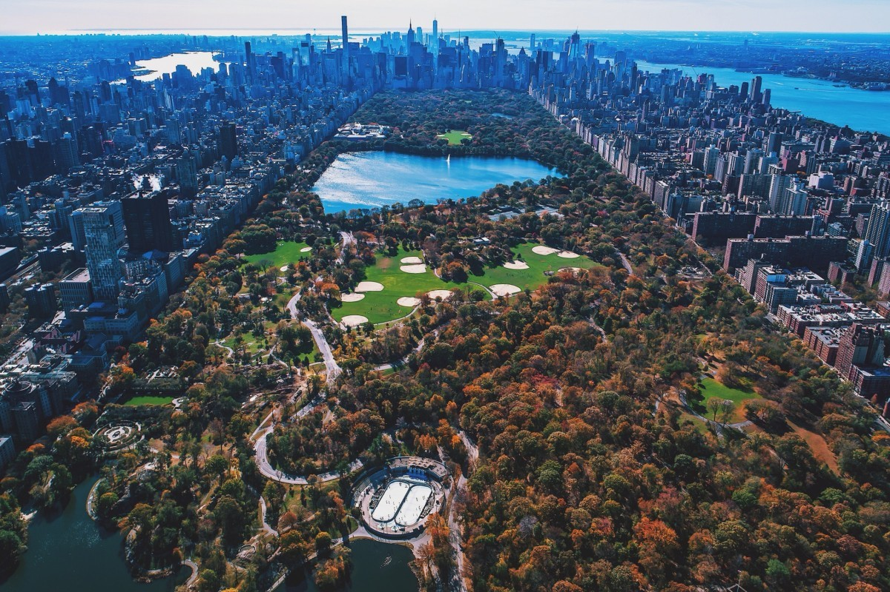

_Original Image_

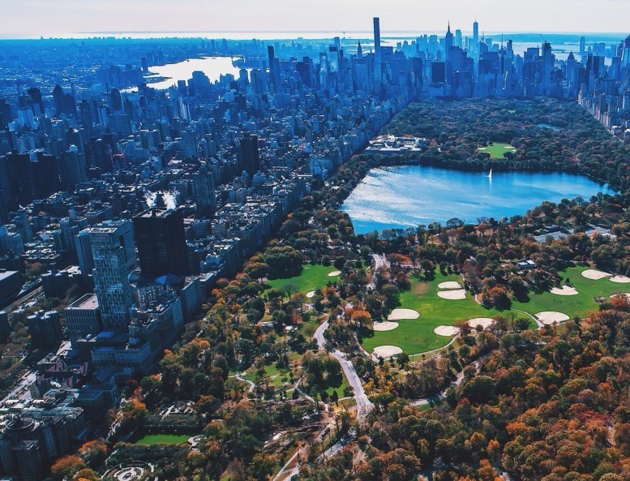

_Normal quality image_

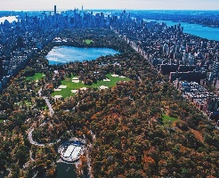

_0.25 downsampled image_

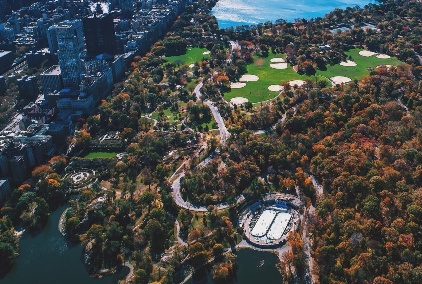

_0.5 downsampled image_

And after the aligning image 1 and 2, and then the result into 3 this is the results we get:

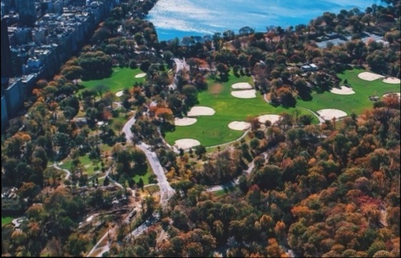

_Result from algorithm_


_Ground truth_

Below are more results, first image is from algorithm and second image is the ground truth.

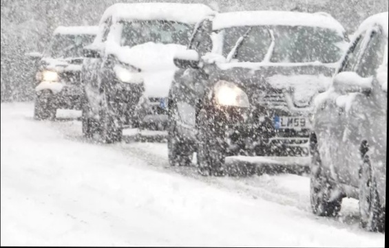
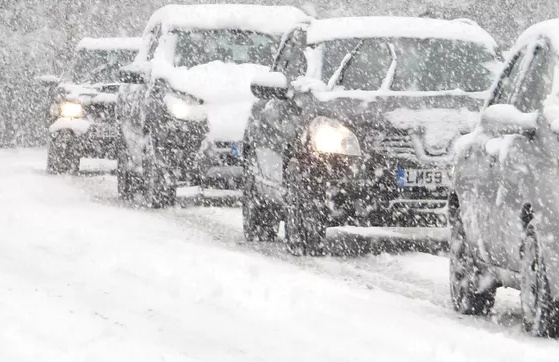

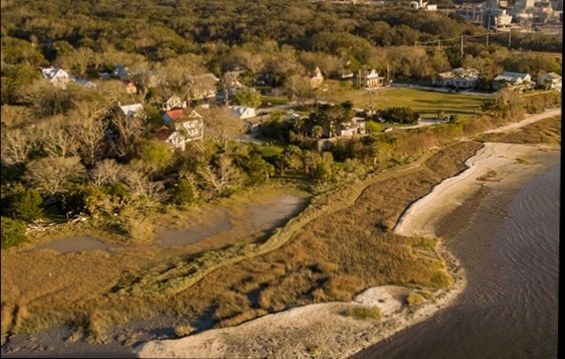
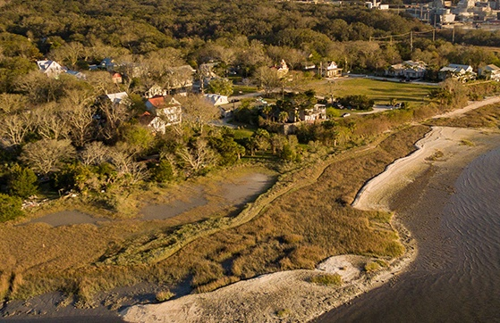

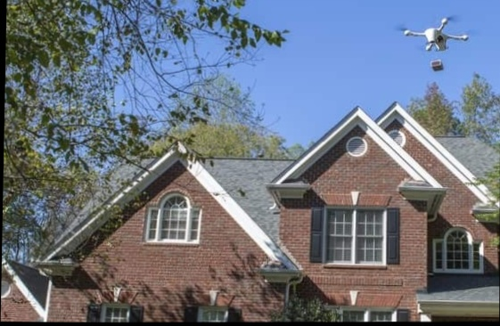
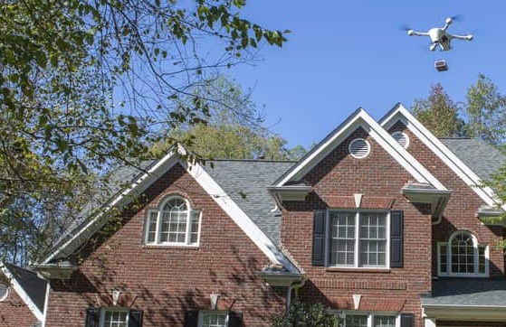

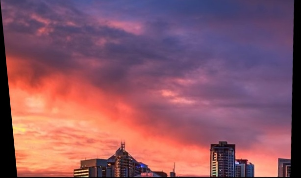


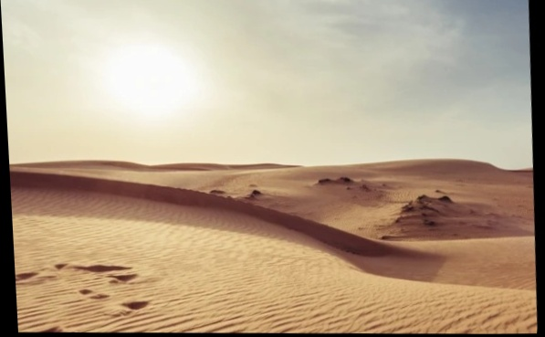
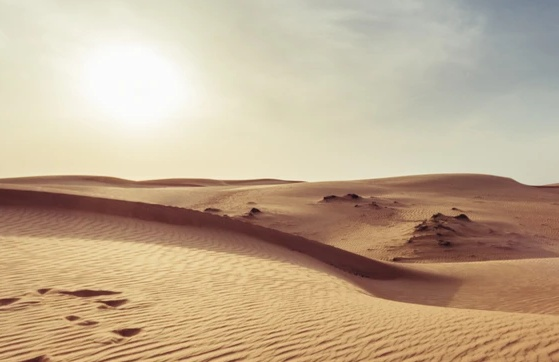

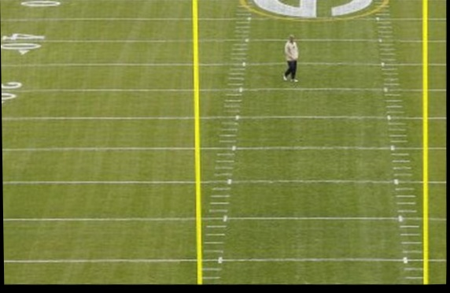
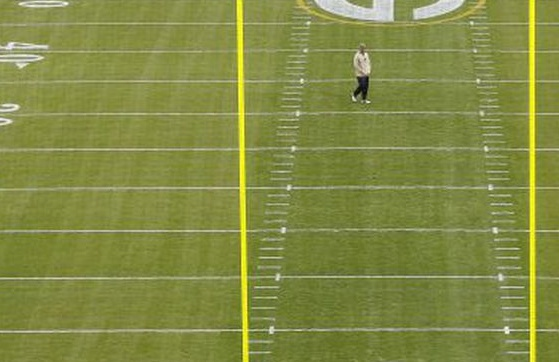


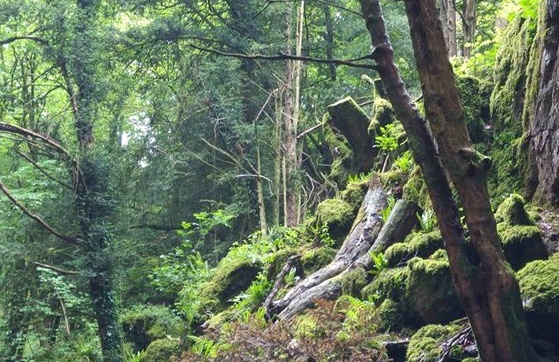

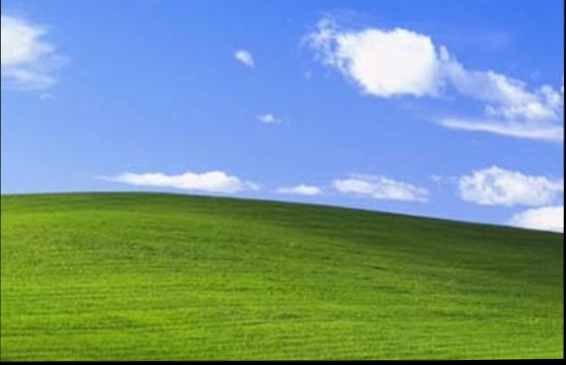
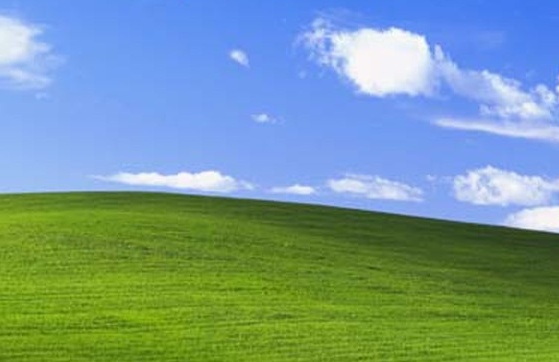

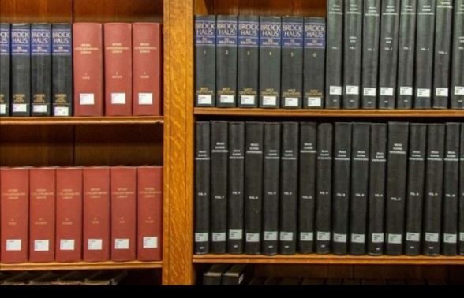
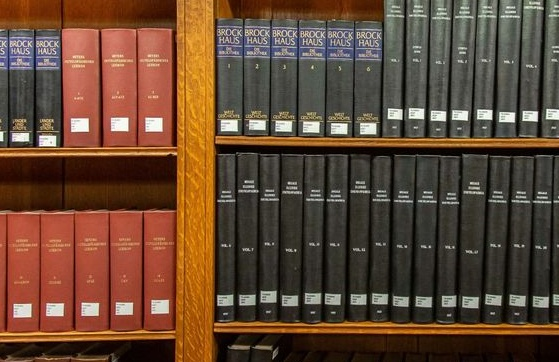

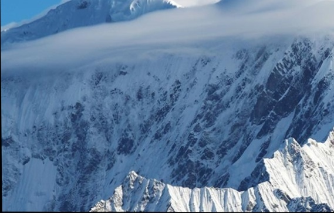

##


### Update 2: Common Area of a HR and a LR Images

Test for common area between one high resolution image and one low resolution one. One image is manually downsampled 
to 0.25 size to simulate real life data. The process are as follows:

1. Upsample low resolution image
2. Get keypoints from low resolution and high resolution image separately
3. Match their descriptors using RANSAC
4. cv2.warpPerspective and crop image

The results were varied, where some images are warped unrecognizable, while some images showed little difference to 
their results from test one.

Below is an example of manually downsampling and getting a good result. 

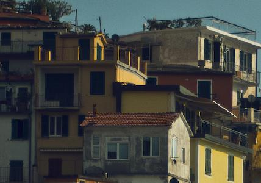

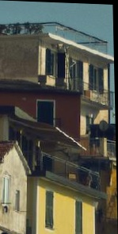


And an example where the results is just unintelligble warping.

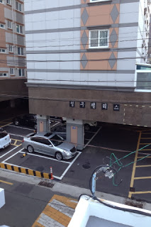

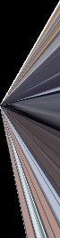

### Update 1: Common Area of Two Similar Images

A test of finding the common area for two similar images. The images are of the same size and somewhat same quality. 
The parameters used are 10000 matches and 0.3 top matches.

Visually, the results were good and can move on to more tests. 


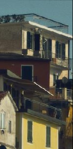


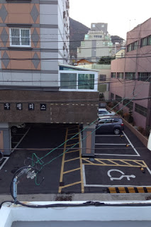
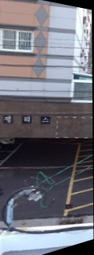

##


### Usage

```
python main.py --ref tis1.jpg --algn tis2.jpg --out align_tis.jpg --matches 20000 --top 0.5 --debug True
python main.py --ref vit2.jpg --algn vit1.jpg --out align_vit.jpg --matches 200 --top 0.15              
```

### Args

```
--ref : reference image path

--algn : shifted image path

--out : saved aligned image name

--matches : number of matches to be observed (default: 200)

--top : top matches (in percentage) that we want to consider (default: 0.15)

--debug : set to True to see matching process

```


